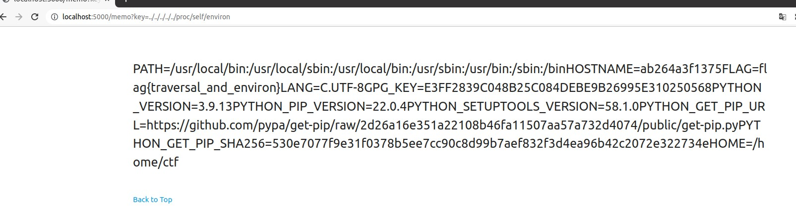

# 詳解セキュリティコンテスト輪読会資料#4

### 7章

**一言まとめ**: ディレクトリトラバーサル、`/proc`

#### 確認事項

手を動かすポイント(ここでやった人いるか & 詰まった人いるか確認)

- [ ] p.125 7.4 攻撃手法(>やった)

#### 話題

- nginxの設定不備問題
  - graneedさんの記事 [nginxの設定不備](https://graneed.hatenablog.com/entry/2019/12/29/115100#nginx%E3%81%AE%E8%A8%AD%E5%AE%9A%E4%B8%8D%E5%82%99)
  - これはCPCTF 2022で出題歴あり [Web/Forbidden 2 (easy) - traP作問者writeup](https://trap.jp/post/1237/)
- `/proc` の話でmisc問で見かけるもの
  - `/proc/self/environ` 以外にも、misc問で `/proc/self/cwd` を使うことがある
  - misc readme SECCON Beginners CTF 2020 [作問者writeup - CTFするぞ](https://ptr-yudai.hatenablog.com/entry/2020/05/24/174914#Misc-272pts-readme-71-solves)
  - `man proc` で目を通しておくとよいが、全部は把握しきれないほどある
- envで `GPG_KEY` がありぎょっとするけどこれはDockerビルド時に書き込まれる、公開してよいもの [stackoverflowの質問](https://stackoverflow.com/questions/50751952/why-do-the-official-docker-python-images-include-a-gpg-key-environment-variable)



### 8章

**一言まとめ**: XSSの概要、CSPの仕様、いくつかのCSPバイパス手法

#### 確認事項

手を動かすポイント(ここでやった人いるか & 詰まった人いるか確認)

- [ ] p.147 CSPのバイパス base-uri(>やった)
- [ ] p.151 DOM Clobberingによるstrict-dynamicのバイパス(>やった)

#### 話題

- つばめさんのxss.shift-js.infoがサービス終了していた...
  - 昔よい教材があった [参考 - XSS Challenge (xss.shift-js.info) writeup](https://akouryy.hatenablog.jp/entry/ctf/xss.shift-js.info)
  - 元はセキュリティ・ミニキャンプ in 岡山 2018 演習コンテンツだったのが公開されていたもの
- p.136 クローラーってどういう実装なんだろう
  - Wani Hackaseのリポジトリに実装例があった [wani-hackase/wanictf21spring-writeup](https://github.com/wani-hackase/wanictf21spring-writeup/blob/b6888c5d23e28935e4729d46e47502bef89a5481/web/wani_request_2/src/api/app.js)
- CSPは Webブラウザセキュリティ を読もう！(まだ積んでます)
- Script gadget, 概念としてはpwnのROP gadgetに近そう
- Pythonだけのコードを動かすときの手順は以下でやっている

```text
cd dir
poetry init
# add deps flask, ...
poetry install
poetry run python3 app.py
```

- baseの例が動かないと思ったら、baseタグ前にlinkなどのurlを含むやつ置くとダメらしいとMDNに書いてある。

> Warning: 以下の属性のいずれかが指定されている場合、この要素は URL の属性値を持つ他の要素、例えば <link> の href 属性などの前に置く必要があります。
> https://developer.mozilla.org/ja/docs/Web/HTML/Element/base

#### 確認クイズ

- XSSの種類、3つ答えよ

{}
- Reflected
- Stored
- DOM based
{}

- 本書で登場したCSPのバイパス手法を3つ答えよ

{}
- ホストからのガジェット組み立て
- base-uriディレクティブの設定不備
- DOM Clobbering
{}


## メモ


