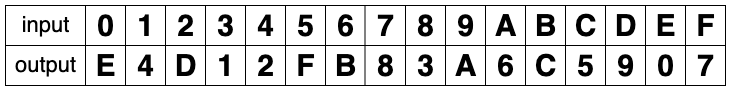

# S-Box

## 概要

S-boxとは、共通鍵暗号の暗号化アルゴリズムのsubstitution部分で用いられる、 $m$ bitの入力を $n$ bitの出力に変換する非線形な関数である。

## 詳細

ブロック暗号がSPN構造の場合、S-boxは復号にその逆変換が用いられることから、全単射である必要がある。そのため少なくとも入力と出力は同一のbit数である。
ブロック暗号がFeistel構造の場合、構造全体自身と逆変換が一致するため、S-boxは全単射である必要はない。
また、出力から入力を推測されないようにするというアルゴリズムにおける役割から、非線形である。 $S(x) = ax+b$ の形をしていてはいけない。

以下、理解のための単純な例とDES,AESの場合の3つを挙げる。

### 単純なS-box

ここでは、入力4bit, 出力4bitとする。4bitをひとまとまりとしてみると入力・出力は `0 ~ F` と表せる(hexの記法) この記法のもとで以下のテーブルで入力を出力に変換する。

例えば、S-boxを関数 $S$ と置くと、 $S(0) = E$, $S(A) = 6$ のようになっている。
テーブルを見ると、全単射であることが分かる。また、Input = 1,2,3に対応するOutputを見ることで非線形であることも分かる。( $S(x) = ax+b$ と仮定するとInput = 0,1より $a=-10,b=14$ となりInput=2に対応するOutputは $-6$ になるが、 $D = 13$ となり仮定に反する)

このS-boxは[文献1](#ref-1)から引用した。

### DESのS-box

DESが最終的に定められた文書(FIPS 46-3, [文献2](#ref-2))では、DES(Data Encryption Standard)とTDEA(Triple Data Encryption Algorithm, いわゆる3DES)が定められている。

S-boxは "_The Cipher Function f_" という項目で "Each of the unique selection functions $S_1, S_2, ..., S_8$ ..."と定められている。 $S_i (i=1,...,8)$ は6bitの入力を4bitの出力に変換する。変換のためのテーブルは、最初と最後のbitをつなげた2bitを縦軸として、残りの真ん中の4bitを横軸として対応する出力を探す形になっている。

### AESのS-box

AESのsubstitution部分はSubBytesと呼ばれる。復号部分はInvSubBytesと呼ばれる。
FIPS PUB 197([文献3](#ref-3))では"5.1.1 `SubBytes()` Transformation"で定義されている。

S-boxは8bitの入力に対し8bitの出力を返す。また逆写像が構成できる。関数 $S$ は有限体 $GF(2^8)$ 上で積に関して逆元をとり、それを $GF(2)$ 上でアフィン変換したものとして構成されている。

## メモ

- AESのS-boxのFPGA実装は省電力やサイドチャネル耐性の話題と関連している。
- 攻撃に対し頑丈なS-boxをどう設計するかが重要とされている。DESのS-boxは設計理由が当初公開されていなかったため、暗号学的なバックドアが仕掛けられているのではないかという疑いが持たれていた。

## 関連する問題

Codegate CTF 2022 Quals - Happy S-box https://affine.group/writeup/2022-02-Codegate-HappySbox
Writeup: Out of the sbox - Insomnihack teaser 2020 http://blog.tihmstar.net/2020/01/writeup-out-of-sbox-insomnihack-teaser.html
SECT CTF 2017 - Bad AES https://pequalsnp-team.github.io/writeups/Bad-Aes
0x41 CTF SPN https://rkm0959.tistory.com/195

## 参考文献

- 文献1:  Howard M. Heys, A Tutorial on Linear and Differential Cryptanalysis
- 文献2:  NIST, FIPS PUB 46-3 DATA ENCRYPTION STANDARD (DES), 1999 October 25
- 文献3:  NIST, FIPS PUB 197 Announcing the ADVANCED ENCRYPTION STANDARD (AES), 2001 November 26

## 関連項目

- AES
- DES
- SPN構造
- Feistel構造

## 外部リンク

# TODO

CTFの問題を探して解く - 順番としては linear cryptoanalysisとか理解した後にwriteupをみる流れが良さそう。
