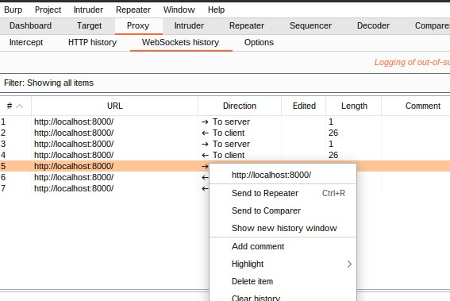
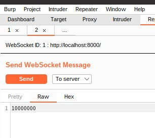
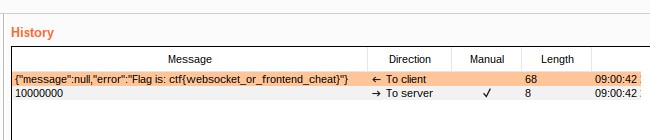

# 単純なCTFの問題作問: Simple Clicker

## 概要

詳解セキュリティコンテスト 6.3 Webクライアントを読んで、クライアントを書くのに慣れる目的で簡単な問題を作ってみました。

[問題リポジトリはこちら](https://github.com/uta8a/pub.challs/tree/main/web/simple-clicker)

この記事を読んで得られること

- 単純なWebsocket clientをPythonで書くスクリプト例
- CTFの問題で、ブラウザの要素をdevtoolsからいじって解くやり方
- 作問過程: fastify, handlebars, nodemonなどを用いた簡単なwebサーバを作る様子

## 詳細

### 問題概要

以下のような、ボタンを押すと clicked `n` times の `n` が1ずつ増えていくサービスが与えられ、たくさん押せばフラグが手に入る。


与えられるソースコードは [`files/`](https://github.com/uta8a/pub.challs/tree/main/web/simple-clicker/files) 以下です。

### 解法

`public/` 以下がフロントエンド、`index.js` がサーバのコードになっています。 `FLAG` などでソースコード検索をかけてみましょう。

index.jsに以下のような記述があります。 [link](https://github.com/uta8a/pub.challs/blob/af9b8d97d5a8d773fa5024a3056c3588419b9980/web/simple-clicker/files/index.js#L39-L57)

```js
wsHandler: (conn, req) => {
    conn.setEncoding('utf-8')
    conn.socket.on('message', message => {
        const data = filterInt(message.toString());
        console.log(data)
        if (isNaN(data)) {
            const reply = {message: null, error: 'not a number'}
            conn.socket.send(JSON.stringify(reply))
            return
        }
        if (data + 1 > CLICK_MAX) {
            const reply = {message: null, error: `Flag is: ${process.env.FLAG}`}
            conn.socket.send(JSON.stringify(reply))
            return
        }
        const reply = {message: data+1, error: null}
        conn.socket.send(JSON.stringify(reply))
    })
}
```

どうやらwebsocketを通じてデカい数字を送れば、`data + 1` が巨大になってerrorとしてフラグが返ってきそうです。

ここでは、2つの方法で解いてみることにします。

### 解法1: ブラウザの要素をいじる

これはブラウザのソースコードが比較的単純な時に有効です。

今回だと `public/index.hbs` が`id="counter"` の要素のtextContentを取ってきて数字に変換して送っています。なので、その要素の中身をブラウザのdevtoolsから直接書き換えてからボタンを押せばフラグが手に入ります。

### 解法2: pythonでクライアントを書く

これはブラウザが難読化jsで解法1が使いにくい、かつサーバのソースコードや挙動が分かる時に使えます。

ブラウザ以外のクライアントがサーバと通信するような、GUIアプリのゲームチート問でもこれが使えます。

コードは [こちら](https://github.com/uta8a/pub.challs/tree/main/web/simple-clicker/solver) に置きました。poetryを使ってパッケージ管理をしています。

最終的に以下のようにflagを得られました。(作問時の画像なのでフラグの中身は別になっています)


### 作問過程

web問やmiscのgame cheat問の構造を、クライアントとサーバに着目して分類する。(その他もありうる)

- クライアントにflagが存在
- サーバにflagが存在

図のように分類できる。実際はサーバにフラグがありかつクライアントが難読化されていて、サーバの代わりとなるものを作ってあげてクライアントを騙すなど色々な種類があるので一例として。


今回は、難読化の勉強をしたかったので [JavaScript obfuscator](https://github.com/javascript-obfuscator/javascript-obfuscator) を使いたかったが、その前にkusuwadaさんのブログ(参考文献1)を読んでクライアントを書く問題を一個挟んでもいいなと思い作問した。

また、expressが使われがちだけどfastifyがいいとか、nodemonとか使ったことないので慣れる目的もあった。

流れ

- fastifyでhello world返すサンプルをnodeで動かす
- handlebarsをテンプレートとして使うことに決めた
- nodemonでホットリロード効かせた
- websocketを調べた
- dockerに載せた

その他色々

- [fastifyの最初に見る場所](https://www.fastify.io/docs/latest/Guides/Getting-Started/)
- npmバージョン固定は `npm install <name> --save-exact`
- nodemonは `e` 指定でホットリロード監視が効く `nodemon -e js,html index.js`
  - デフォルトで `-e` なしでは `js,mjs,json` を見に行く。`-e html` だとhtmlだけを見に行ってjsを見に行かない。今回はjs,htmlを指定したいので、 `-e js,html` とした。
- [fastifyのプラグインはここから選ぶ](https://www.fastify.io/ecosystem/)
- Docker内では `0.0.0.0` を指定する
  - `localhost` 、つまり `127.0.0.1` はコンテナ内の `127.0.0.1` とホストの `127.0.0.1` が異なるのでアクセスできない。
  - `0.0.0.0` はホストのすべてのネットワークインターフェースでlistenするのでアクセスできる。
  - 詳しくは [[Docker]0.0.0.0でサーバーを立てる理由(Python)](https://zenn.dev/shake_sanma/articles/1c6475ba73da48) が分かりやすい。

## メモ

### ESM対応とdocker distroless:nodejs

ESM対応したコードを書きたいと思って書いてみた。しかしdistrolessは [`node` がエントリーポイント](https://github.com/GoogleContainerTools/distroless/blob/0d757ece34cdc83a2148cea6c697e262c333cb84/nodejs/BUILD#L15)なので `node` の引数で `.mjs` 対応をせずにES Modulesにしようと考えた。

結局 [こちらのissue](https://github.com/nodejs/node/issues/41136#issuecomment-991650220) を読んでscriptを補助で書くことで対応した。これはexperimentalなので壊れる可能性が高いが、時代はESMへ向かうのでそのうちloader指定などはいらなくなると思う。

(追記) nodeがpackage.jsonを読みにいくので、distrolessの最終ステージにもpackage.jsonをコピーすると上記の対応はいらない。 `type: "module"` を書くだけで済む。

### websocketはchrome devtoolsのネットワークタブで見れる

すごい見やすい。


しかもバイナリも見れる [参考](https://developer.chrome.com/blog/new-in-devtools-74/#:~:text=Click%20one%20of%20the%20Binary%20Message%20entries%20to%20inspect%20it.)

### websocketとsocket.ioは違う

最初pythonのライブラリでpython-socketioを使っていたら通信が失敗するのであれれと思っていたら、どうも両者が別物らしい。まだ理解できてないので理解したい。

### 別解: wscat, burpの書き換え

[websockets/wscat](https://github.com/websockets/wscat) を使うと対話的にncのようにwebsocketを扱えるので便利。

また、Burp Suite (v2022.3.9 で確認)でも以下のようにwebsocket historyからrepeaterに送って書き換えて送ることで解ける。 







### 今後参考にしたい問題

game cheat関連

- [CakeCTF 2021 misc kingtaker](https://github.com/theoremoon/cakectf-2021-public/tree/master/misc/kingtaker)
  - [作問者writeup](https://ptr-yudai.hatenablog.com/entry/2021/08/30/000015#cheat-Kingtaker)
  - GameMaker:Studioを用いたブラウザゲーム
  - ブラウザのメモリハックが想定解

## 参考文献

- 1: [ångstromCTF 2020 Web分野の復習 writeup - 好奇心の足跡](https://tech.kusuwada.com/entry/2020/04/05/132308#section1)
  - angstrom ctf 2020 web Woooosh
  - kusuwadaさんが2通りの解き方を提示されているところから、今回は通信部分を取り出して調べることにした。
- 2: [ångstromCTF 2020 の write-up Woooosh - st98 の日記帳](https://st98.github.io/diary/posts/2020-03-19-angstromctf.html#web-130-woooosh-175-solves)
  - 同じくWooooshのwriteup
  - JavaScript obfuscatorを知った
