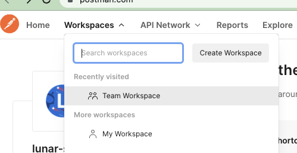
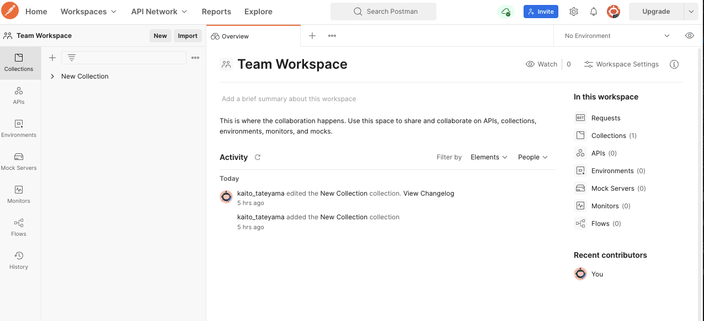
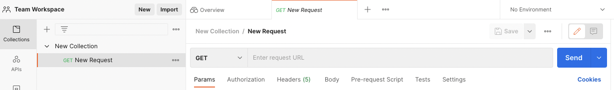
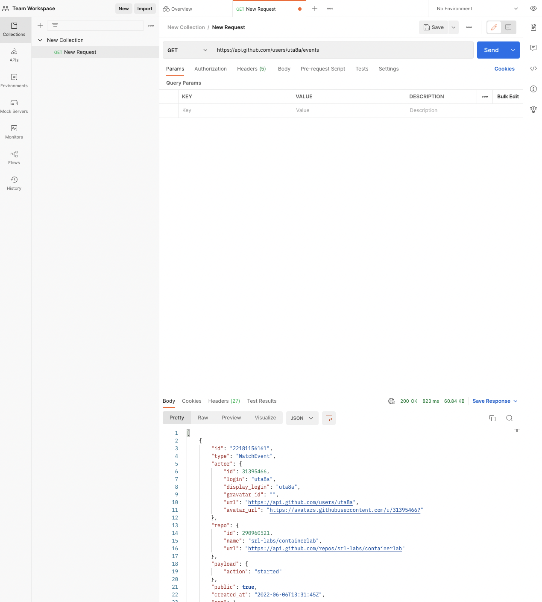

{/* import */}

import { Icon } from 'astro-icon'
import { Notification } from 'accessible-astro-components'

{/* content */}

# APIを触ってみよう

## 概要

この記事では以下のことを学びます。

座学編

- APIとは何なのか
- APIの使い方
  - ツール(curl, postman)
  - コード(TypeScript, Python)
- APIを使う時に気をつけること

実習編

- GUI: Postmanを使ってGitHub API (認証なし) を叩いてみよう
  - アカウント作成
  - APIを叩く
- CUI: curlを使ってniconico動画API (認証なし) を叩いてみよう

## 座学編

## APIとは何なのか

APIとはアプリケーションプログラミングインターフェースの略です。例えば、今回だとWebの話なので以下のような状況を想定します。

- 「サーバ」というものがあり、僕たちが「クライアント」からそのサーバと通信を行いたい。


この通信について、サーバとクライアントの間でこういう風に通信をしますよ、というルールをAPIと言います。

ただ、このAPIという用語は曖昧で、実際「APIを叩く」という言葉がよく使われますが、これは「通信する時のサーバ側の末端(エンドポイント)と通信を行う」という意味になっていたりと、広くサーバとクライアントの間のやりとりをAPIという言葉で指します。

## APIの使い方

APIを叩く時には、数回で済むときはツールを使い、何度も違う内容で叩く必要があって自動化したくなったときはコードを使うことが多いです。

### 使い方1 ツール

色々ありますが、ここではPostmanとcurlを紹介します。どちらがいいというものではなく、どちらも使えるようになっておくと良いです。

[Postman](https://www.postman.com/)

- Webブラウザやアプリから使えるツール。
- GUIでできるので直感的で使いやすい
- 外向けのリクエストはブラウザでできるが、自分のPCで立てたサーバに対してリクエストを送るときはデスクトップアプリが必要。(localhostへのリクエスト)

[curl](https://github.com/curl/curl)

- ターミナルから使えるツール
- CUIなので使い方を調べる必要があり慣れないうちは大変
- localhostへのリクエストは普通に送ることができる

### 使い方2 コード

これも様々な言語から利用することができます。ここでは、JavaScript/TypeScriptからの利用と、Pythonからの利用を見ていきましょう。

JavaScript/TypeScript

- `fetch` を使います
- [使い方ページ](https://developer.mozilla.org/ja/docs/Web/API/Fetch_API/Using_Fetch)
- 使い方は以下のような感じ

```js
// index.js
fetch('http://example.com/api-endpoint') // デフォルトでgetリクエストを送る
  .then(response => response.text())
  .then(data => console.log(data)); // 取得したデータを出力
```

Python

- `requests` ライブラリを使います
- [使い方ページ](https://requests-docs-ja.readthedocs.io/en/latest/)
- 使い方は以下のような感じ

```python
# main.py
import requests # ライブラリをインポート

res = requests.get('https://example.com/api-endpoint') # getリクエストを送る
print(res.text) # 取得したデータを出力
```

## APIを使う時に気をつけること

これは**大事な話**になります。

APIはサーバの資源を利用する行為です。リクエストを過剰に送った場合、相手のサーバに負荷を与えることになります。この行為は行き過ぎるとDoSやDDoSといった攻撃と同じことをしていることになってしまいます。

そのため、以下のことに気を付けてください

- 一度外部のサーバにリクエストを送ったあとは**少なくとも1秒は間隔を開ける**
  - ツールを使って手動で行っているときはあまり気をつける必要はないですが、コードを用いてfor文でリクエストを複数回飛ばすときは気をつけましょう。
  - また、1秒だと絶対安心というものでもないです。間隔をどのくらい開けたらいいかは調べて調整して自己責任で行いましょう。
- 非公開APIをなるべく触らない
  - ドキュメントとして公開されていないけど、表から叩けるAPIのことを非公開APIと言います。あまり触らない方がいいです。
- **APIを叩いた人はサーバに記録される**
  - 自分のIPアドレスや、認証ありのAPIの場合認証情報を通してアカウント情報がサーバ側でログに記録されています。このことを念頭に置いて利用しましょう。

これらを守っていれば怒られることはありません。気をつけることは気をつけて、その上でしっかり利用していきましょう！

## 実習編

では座学編で大体雰囲気をつかんだと思うので、実際にAPIを利用してみましょう！

ここではツールを利用します。また、認証ありのAPIは認証の仕方がそれぞれで異なっているので今回は省略します。

## GUI: Postmanを使ってGitHub API (認証なし) を叩いてみよう

今回は、GitHub API ([ドキュメント](https://docs.github.com/ja/rest)) を触ってみましょう。

[Postman](https://www.postman.com/) へアクセスしてアカウントを作成してください。

Workspaceに入りましょう



Workspaceの左側のCollectionを作りましょう



Collectionの下にNew Requestを作りましょう



GETを選択し、URLに `https://api.github.com/users/uta8a/events` と入れてみましょう。これは僕(ユーザ名: uta8a)のGitHubアカウントの公開情報を見ることができるAPIです。



下にサーバからJSONという形式で送られてきたレスポンスが表示されています。

APIを叩いて、サーバと通信することができました！

## CUI: curlを使ってniconico動画API (認証なし) を叩いてみよう

ここでは、curlを使ってniconico動画のAPIを叩いてみます。

[ドキュメント](https://site.nicovideo.jp/search-api-docs/snapshot) を見ながら試してみましょう。

まずは例そのまま。これで「初音ミク」と検索をかけた時のランキング上位から3つが表示されます。

```text
$ curl -A 'apiguide application' 'https://api.search.nicovideo.jp/api/v2/snapshot/video/contents/search?targets=title&fields=contentId,title,viewCounter&_sort=-viewCounter&_offset=0&_limit=3&_context=apiguide_application' --data-urlencode "q=初音ミク" --data-urlencode "filters[viewCounter][gte]=10000"

{"data":[{"contentId":"sm1097445","title":"【初音ミク】みくみくにしてあげる♪【してやんよ】","viewCounter":15936313},{"contentId":"sm15630734","title":"『初音ミク』千本桜『オリジナル曲PV』","viewCounter":15550600},{"contentId":"sm1715919","title":"初音ミク　が　オリジナル曲を歌ってくれたよ「メルト」","viewCounter":15007350}],"meta":{"id":"24206b1b-c0f5-4451-b878-c40dab0b2c9a","totalCount":19015,"status":200}}
```

初音ミクを稲葉曇に変えて、viewCounterを少し減らしてみます。やはりラグトレインが人気なんですね。

```text
$ curl -A 'apiguide application' 'https://api.search.nicovideo.jp/api/v2/snapshot/video/contents/search?targets=title&fields=contentId,title,viewCounter&_sort=-viewCounter&_offset=0&_limit=3&_context=apiguide_application' --data-urlencode "q=稲葉曇" --data-urlencode "filters[viewCounter][gte]=100"

{"data":[{"contentId":"sm37198038","title":"稲葉曇『ラグトレイン』Vo. 歌愛ユキ","viewCounter":3031537},{"contentId":"sm32801250","title":"稲葉曇『ロストアンブレラ』Vo. 歌愛ユキ","viewCounter":850058},{"contentId":"sm38728089","title":"稲葉曇『ハルノ寂寞』Vo. 弦巻マキ","viewCounter":468954}],"meta":{"id":"58f37237-19f6-4954-ab33-beddc0455e30","totalCount":106,"status":200}}
```

色々変えてみます。likeCounterというのでいいね数が見れます。いよわさんはきゅうくらりんが人気ですね。

```text
$ curl -A 'apiguide application' 'https://api.search.nicovideo.jp/api/v2/snapshot/video/contents/search?targets=title&fields=contentId,title,viewCounter,likeCounter&_sort=-viewCounter&_offset=0&_limit=3&_context=apiguide_application' --data-urlencode "q=いよわ"

{"data":[{"contentId":"sm39257413","title":"きゅうくらりん / いよわ feat.可不","viewCounter":1937821,"likeCounter":5616},{"contentId":"sm35933131","title":"IMAWANOKIWA / いよわ feat.初音ミク","viewCounter":655659,"likeCounter":1416},{"contentId":"sm37944844","title":"1000年生きてる / いよわ feat.初音ミク","viewCounter":612379,"likeCounter":3098}],"meta":{"id":"ddbf8c1e-a17b-49e4-887c-345f80897c15","totalCount":167,"status":200}}
```

これでniconico動画APIを叩くことができました。CUIは慣れると簡単なのでぜひ使えるようになりましょう。

