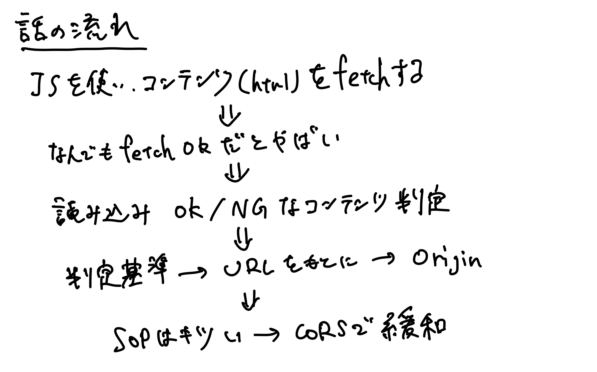

{/* import */}

import { Icon } from 'astro-icon'
import { Notification } from 'accessible-astro-components'

{/* content */}

# 詳解セキュリティコンテスト輪読会資料#3

### 6章

**一言まとめ**: Webサーバ、Burp、データベース、CORSなどのブラウザセキュリティ

#### 確認事項

手を動かすポイント(ここでやった人いるか & 詰まった人いるか確認)

- [ ] p.86 コード6-17 nginx (>省略)
- [ ] p.88 コード6-18 webapp (>やった)
- [ ] p.93-96 Burp Intercept/Repeater (>やった [video link 1](https://drive.google.com/file/d/1NQvetUmg3WxDFRAVBro6ZTRbi2y6INFL/view?usp=sharing) / [video link 2](https://drive.google.com/file/d/1dkgJUOvK7n3PfpfBgZ4Xoj4A4t9g8heL/view?usp=sharing))
  - Burpの導入は、Vagrantfileを見るとターミナルからできる。 [該当箇所](https://github.com/ctfbook/2nd/blob/c364a010b936eb428c70e91b656965a9b2e95bec/dist/Vagrantfile#L73-L79)
- [ ] p.97-101 Burp Intruder(>やった)
- [ ] p.103-113 SQLの実習パート(>半分くらいやった)

#### 話題

- p.86 nginxの設定不備問題
  - 最近だと [CPCTF2022](https://trap.jp/post/1237/#webforbidden-2-easy) で出題された。
  - [graneedさんのブログ](https://graneed.hatenablog.com/entry/2019/12/29/115100#nginx%E3%81%AE%E8%A8%AD%E5%AE%9A%E4%B8%8D%E5%82%99) も参照
- p.88 コード6-18のwebappが動かないので動くようにした
  - これは割と些末な話なのでskipしていいかも
- p.90 Burp: [WebSecurity Academy](https://portswigger.net/web-security) がいい学習リソースだよという紹介
- p.102 decoder: 単なるencode/decodeは [CyberChef](https://gchq.github.io/CyberChef/) も便利。送信もセットで楽に行える点でBurpに強みがある。
- p.103 データベース問でCPCTFのupsolveしたい
  - [Web_Generate_ORiginal_Memo](https://github.com/CPCTF2022/Web_Generate_ORiginal_Memo)
  - [解説](https://trap.jp/post/1572/)
- p.113 Webブラウザセキュリティ: [Webブラウザセキュリティ ― Webアプリケーションの安全性を支える仕組みを整理する](https://www.lambdanote.com/products/wbs) が参考になりそう。
  - CORS周り図を書いて理解したい。まだ理解できてない。 → ストーリーラインは理解した！より複雑なCORSはまだ理解できてない。
  - Webブラウザセキュリティ本の2章はじめに、なぜSOPを導入するのかの例が詳解セキュリティコンテストよりも包括的に書かれていて、読んでいて納得感があり分かりやすい。
- p.113 Webブラウザセキュリティ: ちょっと外れる話題だけど、Shadow DOM Closedとchrome extensionの話題と、prototype pollutionによりclosedは回避できるのでDOMにセキュアな情報は置いてはいけないという話

#### SOPとCORSの話の流れ

まとめてみた

