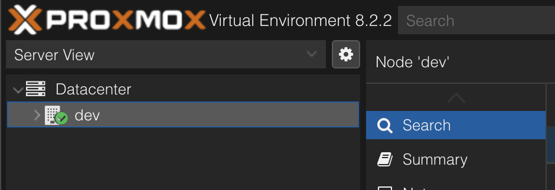
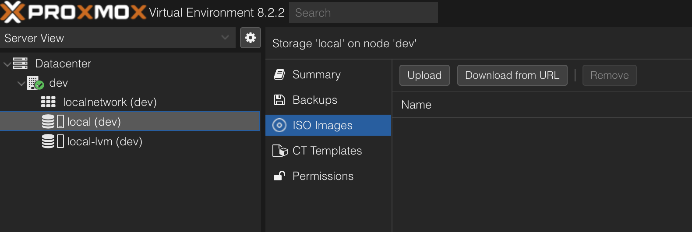
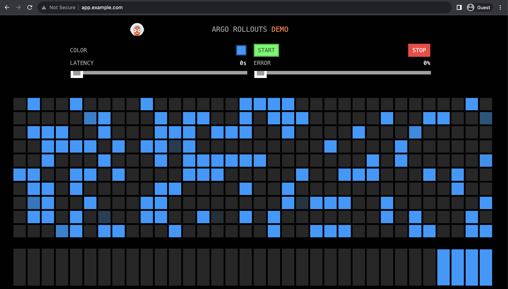
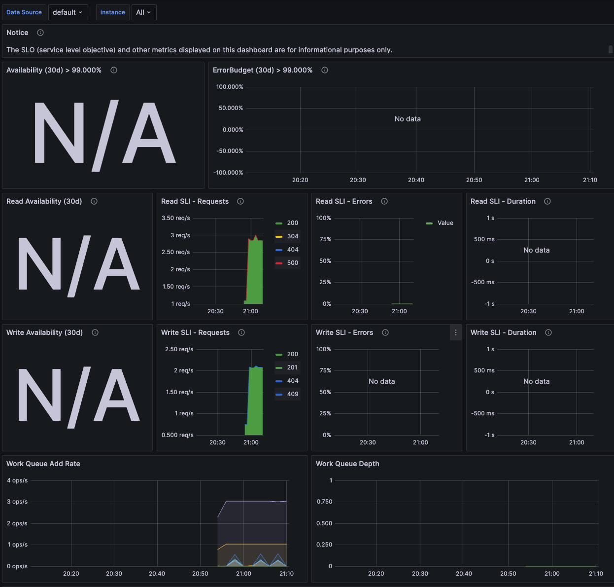

{/* import */}

import { Icon } from 'astro-icon'
import { Notification } from 'accessible-astro-components'

{/* content */}

# 一日で学ぶクラウドネイティブ技術実践ハンズオン 2023 を途中までやった

[CloudNative Days Summer 2024 CNDS2024 Hands-on](https://event.cloudnativedays.jp/cnds2024/hands-on) の話題を見かけて、僕もクラウドネイティブなOSSを触ってみたいと思いました。リストアップされていたのは以下のOSSです。

- Docker
- Kubernetes
- Prometheus
- Grafana
- Pyroscope
- Loki
- Tempo
- Open Telemetry
- Cilium
- Argo CD
- Argo Rollouts
- Istio
- Hubble

この中で動かしたことがあるのはDocker, Kubernetes, Prometheus, Grafanaくらいでした。

# cloudnativedaysjp/cnd-handson

以前も似たようなクラウドネイティブなOSSのハンズオンあったなと思って調べると [cloudnativedaysjp/cnd-handson: 『一日で学ぶクラウドネイティブ技術実践ハンズオン』by CloudNative Days Tokyo 2023 実行委員会のドキュメントです。](https://github.com/cloudnativedaysjp/cnd-handson) が見つかりました。去年のハンズオンのリポジトリのようなのでこれをやります。

# やったこと

minisforumのミニPCにProxmoxを入れます。

## Proxmoxを入れる

- USBにProxmoxのISOを焼く
- インストール

CIDR周りの理解が浅くて困りました。ずっとネットワークに苦手意識があるのでまとまった時間で勉強しないと...

Ubuntu Serverだとnetplanなのですが、Proxmoxの場合は `/etc/network/interfaces` をいじると良いようです。結局DHCPにしました。



キタキタ



ISO Imageをuploadできるようなので、手元PCからアップロード

Ubuntu 24.04 をproxmoxのVMとして入れました。

Ubuntu Serverは入れる時にgithubからpublic keyを取ってこれるので、そこで設定をしてSSHの疎通まで行いました。

これでProxmoxのインストールは良し。

## cnd-handsonをやる

https://github.com/cloudnativedaysjp/cnd-handson

kindを入れる

### 遭遇したエラー: read: connection reset by peer - error from a previous attempt:...

初手でつまづきました。

```
sudo kind create cluster --config=kind-config.yaml
```

`kubectl cluster-info` でエラー

```
error: Get "http://localhost:8080/version?timeout=32s": read tcp 127.0.0.1:58230->127.0.0.1:8080: read: connection reset by peer - error from a previous attempt:...
```

バージョンを上げたり色々試していましたが、うまくいかず

```
~/cnd-handson/chapter01_cluster-create$ kubectl cluster-info dump
The connection to the server localhost:8080 was refused - did you specify the right host or port?
```

良くみたらUbuntuユーザなので認証必要そうと思い、以下を試したら通った

```
KUBECONFIG=$HOME/.kube/config
sudo kind get kubeconfig > ~/.kube/config
```

よくみたらNoteに書いてある

---

ブラウザアクセスまで行けた



感動

Prometheus, Grafanaを入れるところはスイスイ行けました

この時点でVMに割り当てたメモリのうち8GBを使っていたので、ミニPCのメモリは16, 24くらい積んでおかないと足りなくなるかもしれません。



デフォルトダッシュボードを眺めて楽しいです
Slackへのアラートはskipしました

OpenTelemetryへ行きます。

まずインストール段階で詰まりました。

### helmでエラー

helmで色々入れるところでエラー

```
COMBINED OUTPUT:
  WARNING: Kubernetes configuration file is group-readable. This is insecure. Location: /home/uta8a/.kube/config
  WARNING: Kubernetes configuration file is world-readable. This is insecure. Location: /home/uta8a/.kube/config
  Release "jaeger-operator" does not exist. Installing it now.
  Error: 2 errors occurred:
  	* Internal error occurred: failed calling webhook "webhook.cert-manager.io": failed to call webhook: Post "https://cert-manager-webhook.cert-manager.svc:443/mutate?timeout=10s": dial tcp *.*.*.*: connect: operation not permitted
  	* Internal error occurred: failed calling webhook "webhook.cert-manager.io": failed to call webhook: Post "https://cert-manager-webhook.cert-manager.svc:443/mutate?timeout=10s": dial tcp *.*.*.*: connect: operation not permitted
```

なんかよく分からない

バージョンを上げたらupgrade guide見てねと言われた。破壊的変更によりvaluesのyamlを書き換える必要があるみたい。

```
> UPGRADE FAILED: execution error at (opentelemetry-operator/templates/NOTES.txt:2:3): [ERROR] 'manager.collectorImage.repository' must be set. See https://github.com/open-telemetry/opentelemetry-helm-charts/blob/main/charts/opentelemetry-operator/UPGRADING.md for instructions.
```

exampleを見ながら書き換えた

また違うエラー

```
COMBINED OUTPUT:
  WARNING: Kubernetes configuration file is group-readable. This is insecure. Location: /home/uta8a/.kube/config
  WARNING: Kubernetes configuration file is world-readable. This is insecure. Location: /home/uta8a/.kube/config
  Error: UPGRADE FAILED: Unable to continue with update: CustomResourceDefinition "opentelemetrycollectors.opentelemetry.io" in namespace "" exists and cannot be imported into the current release: invalid ownership metadata; label validation error: missing key "app.kubernetes.io/managed-by": must be set to "Helm"; annotation validation error: missing key "meta.helm.sh/release-name": must be set to "opentelemetry-operator"; annotation validation error: missing key "meta.helm.sh/release-namespace": must be set to "monitoring"
```

丸ごとエラー文をGitHub Copilot Chatに投げる

```
kubectl delete crd opentelemetrycollectors.opentelemetry.io
```

を提示してきたので実行

さらに似たエラーが出たので

```
kubectl delete crd instrumentations.opentelemetry.io
```

を実行

もう一度helm syncしたら成功した。

---

fileのexporterをやるところはうまくいった。

でもprometheusに送るところでエラー

### prometheusremotewrite

なんかstatusがエラーなので嫌な予感がする

```
$ kubectl get daemonsets,pods -l app.kubernetes.io/name=metrics-collector-collector
NAME                                         DESIRED   CURRENT   READY   UP-TO-DATE   AVAILABLE   NODE SELECTOR   AGE
daemonset.apps/metrics-collector-collector   2         2         0       2            0           <none>          22s

NAME                                    READY   STATUS   RESTARTS      AGE
pod/metrics-collector-collector-2wt7h   0/1     Error    2 (21s ago)   22s
pod/metrics-collector-collector-wsgqv   0/1     Error    2 (21s ago)   22s
```

ログを見ると案の定だめだった

```
$ kubectl logs -l app.kubernetes.io/name=metrics-collector-collector -f
Error: failed to get config: cannot unmarshal the configuration: 1 error(s) decoding:

* error decoding 'exporters': unknown type: "prometheusremotewrite" for id: "prometheusremotewrite" (valid values: [otlphttp file loadbalancing debug nop otlp])
```

exporterのkeyに `prometheusremotewrite` を指定できないのかな？と思って調べると、contribというのを入れる必要があるみたい。

参考: https://github.com/open-telemetry/opentelemetry-collector-contrib/issues/30791

```
curl --proto '=https' --tlsv1.2 -fOL https://github.com/open-telemetry/opentelemetry-collector-releases/releases/download/v0.102.1/otelcol_contrib_0.102.1_linux_amd64.tar.gz
```

バイナリは手に入れたけど続きがよく分からない...
chapter04にあるように、これはプラグインの機構をしているはずなのでcontribのバイナリをどこかからロードできるようにしてあげる必要がありそうなんだけど...

というわけで詰まってしまって時間かけても無理だったので諦めた。1週間後に2024年版のcnd-handsonがあるっぽいのでそこでの資料公開を待とう。
