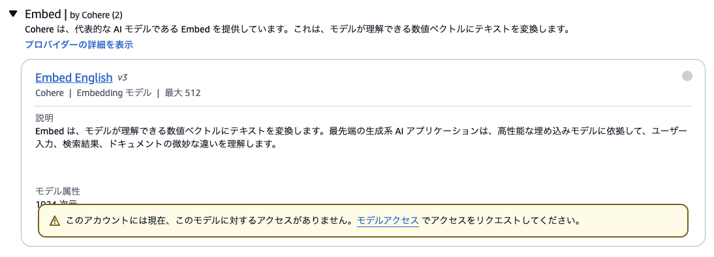
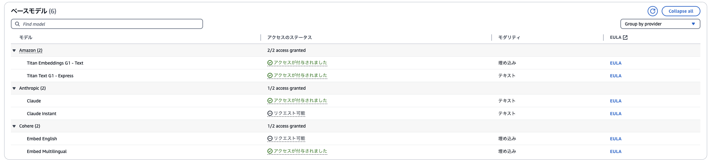
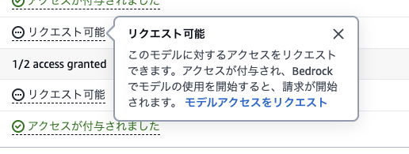
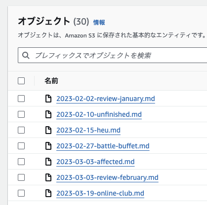
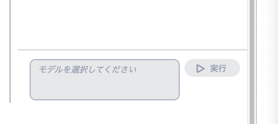
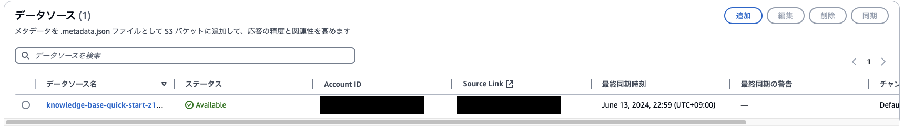
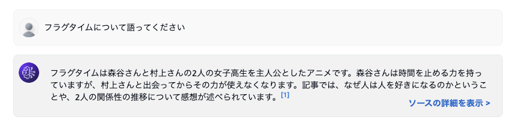
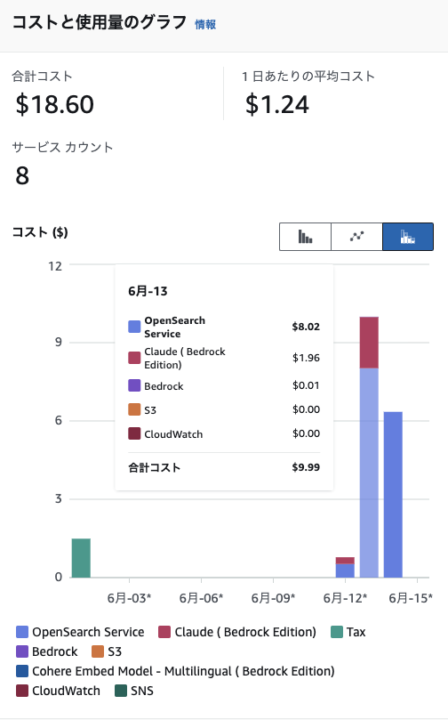

{/* import */}

import { Icon } from 'astro-icon'
import { Notification } from 'accessible-astro-components'

{/* content */}

# uta8a AIを作るまでの雑メモ

いわゆるRAGのようなものを作ります。作り方はいろいろあります。

- ChatGPTに渡す
- OpenAI APIに渡す
- ローカルLLMを使う
- Amazon Bedrockを使う

など

今回はAmazon Bedrockを使ってみました。

流れとしては以下の通り。

1. データをS3に置く
2. ナレッジベースを作る
3. エージェントを作る

今の時点ではナレッジベースを作ってテストで動かしている段階までできています。

## 下準備

モデルの有効化をします。

Amazon Bedrock > 基盤モデル > ベースモデル で適当にモデルを選択しようとすると以下のようなwarning的なのが出ます。

この"モデルアクセス"のリンクをクリック(左側のモデルアクセスからもいけた)

リクエスト可能をクリックすると出てくる部分を見て、"モデルアクセスをリクエスト"を押す

初回は会社とか聞かれるので適当に埋める。

少し待つとモデルが有効化されます。

## データ量を決める

1000トークンで何円というのが書いてあるので軽く料金予測をします。
入力するテキストデータとモデルによってトークン数が変化するので分からないですが、ざっくり https://platform.openai.com/tokenizer を使って調べると、僕のブログ記事の2023,2024年分を入力すると100,000くらいのトークン数になりそうで、仮に高く見積もって1000トークン0.1USDでも10USDにしかならないので法外な値段にはならないだろうと踏んで入力するデータ量を決定しました。

後から思ったのですが、最初はうまく行くまで小さく試してうまく行ったらデータ量を増やす方針を取る方がよかったです。

## データをS3に置く

今回はデータとして blog.uta8a.net の記事を使いました。

バケットを作成し、直下にMarkdownファイルをおきます。今回は特に整形等はしていません。S3に置いて読み込まれるのは PDF、MD、TXT、DOC、DOCX、HTML、CSV、XLS、XLSX です。

参考: [ナレッジベースを使用してドキュメントデータとチャットする - Amazon Bedrock](https://docs.aws.amazon.com/ja_jp/bedrock/latest/userguide/knowledge-base-chatdoc.html)

# ナレッジベースを作成する

[【AWS】BedrockのAgentを使ったら1時間弱でRAGを構築できた](https://zenn.dev/ncdc/articles/41bf6e7735ec9f#bedrock%E3%81%A7%E3%83%8A%E3%83%AC%E3%83%83%E3%82%B8%E3%83%99%E3%83%BC%E3%82%B9%E3%82%92%E4%BD%9C%E3%82%8B)

こちらの記事の「Bedrockでナレッジベースを作る」が参考になりました。

ただ、記事の通りにやるとナレッジベースをテストする段階で以下のようにモデルが選択できませんでした。

これはデータソースの同期を行うことで解決できます。

参考: [同期してデータソースをナレッジベースに取り込む - Amazon Bedrock](https://docs.aws.amazon.com/ja_jp/bedrock/latest/userguide/knowledge-base-ingest.html)

以下のように、最終同期時刻が `-` ではなく具体的な時刻が入っていれば同期が完了しています。

データソースの同期が完了したら、テストを行います。

回答を生成をOFFにすると単なるベクトル検索をしてくれます。ここでナレッジベースにデータがちゃんと入っているかどうか確認できるのでデバッグ時に使うと良いでしょう。

回答を生成をONにして、モデルを選択して質問します。

できました。ソースの詳細を表示からどういう流れで生成されたのかソースが見れるのでデバッグに使えます。

## 今後

今後はエージェントを作って、プロンプトエンジニアリングと外界との繋ぎ込みをしていきます。
あとAWSの料金については、反映されるのが半日後なので、最初に試していた部分が1.8USDくらい、後に試していた部分は請求がまだって感じです。

追記: $18近く請求されました。思ったより多いな？Open Search Serviceってやつがめっちゃかかってそう。

Open Search Service、存在するだけでお金かかるっぽい挙動してる。手で作ると自動で裏で作成されて、ナレッジベース消しても消えないので気づかなかった。手動で探して消したので様子見。
