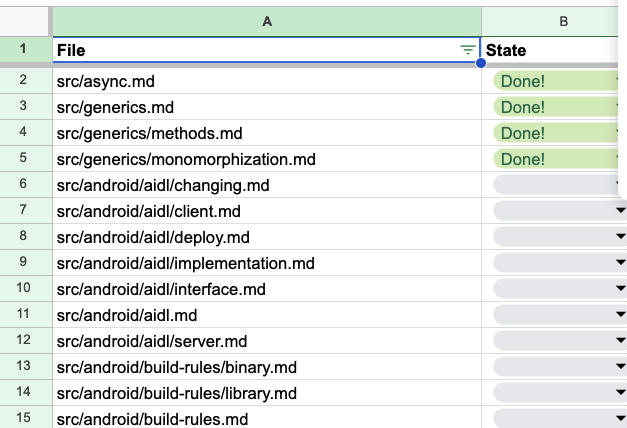

{/* import */}

import { Icon } from 'astro-icon'
import { Notification } from 'accessible-astro-components'

{/* content */}

# 2024-01-02

nissy-devさんのzennのscrapの [Rust の勉強](https://zenn.dev/nissy_dev/scraps/446ff04234e12f) を見ていく。

## Todo

- [ ] [Welcome to Comprehensive Rust 🦀 - Comprehensive Rust 🦀](https://google.github.io/comprehensive-rust/ja/index.html)
- [ ] [Tokio チュートリアル (日本語訳)](https://zenn.dev/magurotuna/books/tokio-tutorial-ja)

---

まずは Comprehensive Rust からいくか。

そういや Comprehensive Rust は日本語訳プロジェクトが動いていたような

これ関連ありそう

- [Translations · Issue #282 · google/comprehensive-rust](https://github.com/google/comprehensive-rust/issues/282)
- [Japanese translation · Issue #652 · google/comprehensive-rust](https://github.com/google/comprehensive-rust/issues/652)

韓国語のみが完了しているらしい。

PR例はこんな感じ: [ja: translate Ch. 54 by HidenoriKobayashi · Pull Request #1573 · google/comprehensive-rust](https://github.com/google/comprehensive-rust/pull/1573)

今はどのくらいの進捗なんだろう。

[このcomment](https://github.com/google/comprehensive-rust/issues/652#issuecomment-1568408009) から辿れるスプレッドシートに進捗がある。

進め方としてはスプレッドシートに名前を書いて、担当範囲を決めて、ステータスを進めてからPRを出す感じっぽい？

残っているのはpitfallとandroid。参加してみたかったが難しそう。

使われている `.po` というファイルは [Poedit Translation Editor — Poedit](https://poedit.net/) の翻訳用のテキストのファイル形式っぽい。

[Translations - Comprehensive Rust 🦀](https://google.github.io/comprehensive-rust/running-the-course/translations.html)

English版を読む。

---

構成はDay1~Day4までMorningとAfternoonが用意されている

今日は前書きパートだけ読む

## [Welcome to Comprehensive Rust 🦀 - Comprehensive Rust 🦀](https://google.github.io/comprehensive-rust/index.html)

- Android teamが作ったんだ
- Basicコースの上に、Android, Chromium, Bare metal, Concurrencyを載せるイメージ
- macroは対象外

## [Running the Course - Comprehensive Rust 🦀](https://google.github.io/comprehensive-rust/running-the-course.html)

- Google社内では9時-16時で1時間休憩、6時間で3h,3hになっている
- 4日間で全部やるんじゃなくて、間隔を開けるといいらしい
- discussionにあった教員側の体験記 [Teaching Rust in 5 days](https://mo8it.com/blog/teaching-rust/) が面白い。所有権を敷物で比喩して初手の助けを得る話とか、生徒からのフィードバックで穴埋め(rustlingsを採用していたみたい)だけでなくゼロから書くのも欲しい、とか

## [Course Structure - Comprehensive Rust 🦀](https://google.github.io/comprehensive-rust/running-the-course/course-structure.html)

- Bare Metalではmicrobitが必要らしい

---

次は [Welcome - Comprehensive Rust 🦀](https://google.github.io/comprehensive-rust/welcome-day-1.html) から読む。

今日はここまで。
